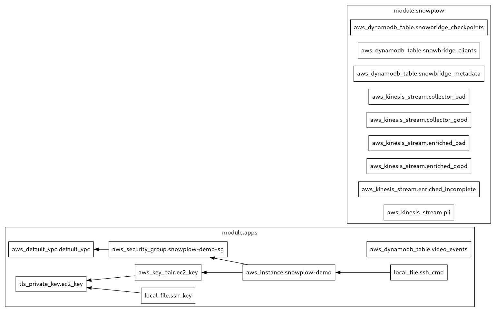

= Generating the infrastructure on AWS through Terraform
:imagesdir: .
:source-highlighter: rouge

== Introduction

The following <<steps>> will allow you to create an infrastructure on AWS. There is
no need to manually install Terraform as it will be executed via Docker using
the *terraform.sh* script. To do this, ensure you have correctly configured the
*../.env* file.

[[steps]]
== Steps

[[step1]]
=== Step 1 -> Initialize the project and check the versions

[,console]
----
$ ./terraform.sh init

$ ./terraform.sh --version
Terraform v1.10.0
on linux_amd64
+ provider registry.terraform.io/hashicorp/aws v5.79.0
+ provider registry.terraform.io/hashicorp/local v2.5.2
+ provider registry.terraform.io/hashicorp/tls v4.0.6
----

[[step2]]
=== Step 2 -> See the Terraform plan

[,console]
----
$ ./terraform.sh plan
----

[[step3]]
=== Step 3 -> Create the infrastructure

----
$ ./terraform.sh apply
----

[[step4]]
=== Step 4 -> Generate a PNG image for the Terraform modules in this project

[,console]
----
$ ./terraform.sh png
----

<<<
[[png-image]]
Current PNG image of the modules available:

[[step5]]
=== Step 5 -> Acessing the EC2 instance that run the apps in AWS

----
$ ./apps/ssh.sh
----

Inside the EC2 instance, you can control the Docker images in a similar way you do locally:

----
$ cd snowplow-demo

$ ./stats.sh # <- show the statistics for the docker containers
$ ./down.sh # <- stop the docker containers
$ ./up.sh # <- start the docker containers
----

[[step6]] 
=== Step 6 -> Destroy the infrastructure

[,console]
----
$ ./terraform.sh destroy
----
